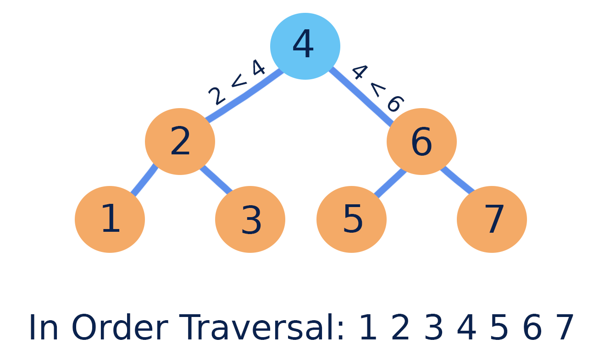

# Tree

## Tree 구조

```
그래프의 일종으로 여러 노드가 한 노드를 가르킬 수 없는 구조이다.
간단하게는 회로가 없고, 다른 두 노드를 잇는 길이 하나뿐인 그래프를 트리라고 부른다.
```


---

## Binary Tree

```
자식노드가 두개 이하인 트리구조
```


---

## Full Binary Tree

```
자식노드가 0개 또는 2개인 이진트리
```


---

## Complete Binary Tree

```
가장 마지막 level을 제외한 나머지 level의 노드들이 가득 찬 이진트리
가장 좌측에서부터 순차적으로 채워져있어야한다.
```


---

## Binary Search Tree

```
루트노드에서부터 좌측에는 더 작은 값을 우측에는 더 큰 값을 채워 넣어 검색에 사용되는 트리
시간복잡도 : O(logN)
```



---

## Tree Traversal

**preorder**
  ```
  노드 -> 왼쪽 서브트리 -> 오른쪽 서브트리 순으로 순회하는 방식
  ```

  **inorder**
  ```
  왼쪽 서브트리 -> 노드 -> 오른쪽 서브트리 순으로 순회하는 방식
  ```

  **postorder**
  ```
  왼쪽 서브트리 -> 오른쪽 서브트리 -> 노드 순으로 순회하는 방식
  ```

  ---